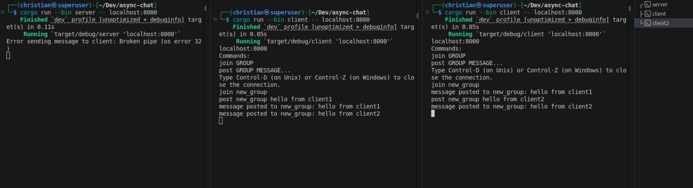

# Async Chat

A real-time asynchronous chat library built in Rust that enables WhatsApp-like group communication functionality.

## Overview

Async Chat is a robust chat system that allows multiple clients to communicate with each other through a central server. The system is built using Rust's async capabilities, providing efficient and scalable group-based communication.

Below is a high-level overview of the system:


## Existing Features

- Asynchronous communication using Rust's async/await
- Group-based chat system with optional password protection
- Group creation and listing
- Password-protected group joining
- Multiple client support
- Real-time message delivery

## Planned Features
- Secure message handling
- WASM (WebAssembly) support

## Prerequisites

- Cargo package manager

## Dependencies

- async-std (1.7) - Async runtime with unstable features
- tokio (1.0) - Async runtime with synchronization features
- serde (1.0) - Serialization framework
- serde_json (1.0) - JSON serialization support
- anyhow (1.0.97) - Error handling

## Installation

Clone the repository using any of the methods below:

- **Using SSH (recommended for developers):**
```bash
git clone git@github.com:Rust-Cameroon/async-chat.git
```

- **Using HTTPS (easier for beginners):**
```bash
git clone https://github.com/Rust-Cameroon/async-chat.git
```

## Usage

1. Start the server:
```bash
cargo run --release --bin server -- localhost:8000
```

2. Start a client:
```bash
cargo run --release --bin client -- localhost:8000
```

### Available Commands

Once connected to the server, you can use the following commands:

- `/create <group_name> [password]` - Create a new chat group. Optionally provide a password to protect the group.
- `/list` - List all available groups on the server.
- `/join <group_name> [password]` - Join an existing group. Provide the password if the group is password-protected.
- `/post <group_name> <message>` - Post a message to a group you have joined.
- `/help` - Show help message with available commands.
- `/quit` - Exit the client.

### Example Workflow

1. Start the server:
   ```bash
   cargo run --release --bin server -- localhost:8000
   ```

2. Connect client 1 and create a group:
   ```
   /create general
   ```

3. Connect client 2 and list groups:
   ```
   /list
   ```

4. Join the group from client 2:
   ```
   /join general
   ```

5. Post messages:
   ```
   /post general Hello everyone!
   ```

### Password-Protected Groups

To create a password-protected group:
```
/create privategroup mysecretpassword
```

To join a password-protected group, the password is required:
```
/join privategroup mysecretpassword
```

Note: Attempting to join a password-protected group without the correct password will result in an error.


## Contributing

Please read [CONTRIBUTING.md](CONTRIBUTING.md) for details on our code of conduct and the process for submitting pull requests.
